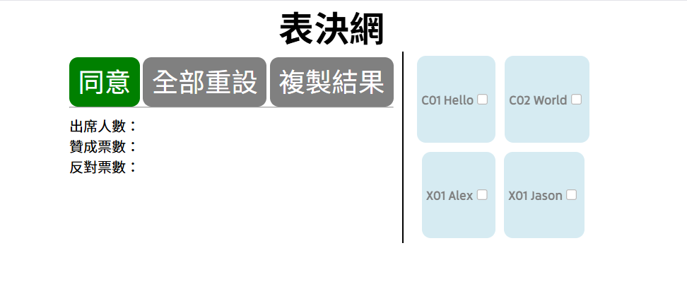

# Vote

originally made for student council's meeting vote system, but works for registered vote in general.  

---

## Instruction

### Follow the steps if you want to try this yourself.  

1. enter voter's data into `voter.json`. (the instruction of editing it is written in the next paragraph)  
1. host this on a local server and open the webpage in a browser.
1. check each checkbox if that voter has attended the meeting.
1. press "同意"/"不同意" to toggle between them.
1. when it's "同意" click on a voter to set them to agree, same for "不同意".
1. press "全部重設" to clear all "同意"/"不同意" but preserves the attend check.
1. press "複製結果" to copy the result in text, and can be pasted into other documents.  

### Structure of `voter.json`
```json
{
    "group":
    [
        {
            "class": "voter's class",
            "name": "voter's name"
        }
    ]
}
```

**Note:**  
* each group forms a row in webpage.
* you can have infinite rows by copying the structure and add `,` in the middle, but too many groups may cause visual bug.
* `class` attribute can leave blank as `""`.
* `class` will be displayed before `name`, but won't be copied into result.
* you can have infinite voters in one group by copying the structure and add `,` in the middle, but too many voters may cause visual bug.

---

## Demo



(link here later)

---

## TO-DO-LIST

* add exception handling for fetching JSON
* let user input custom JSON file (or create in app)
* let user change the format of copied text